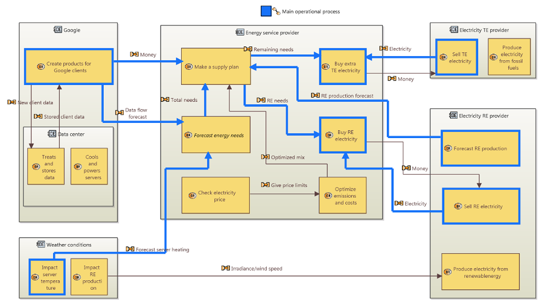

*Author : Rind Alhage, Kai Zhang, Yan Chen, Icare Sakr*

Softerware : Capella 1.4.1

This is course (ROB308) project for ENSTA Robotics.

**Background :** Web giants such as Google are increasingly looking for using renewable energy to power and cool their data centres. By producing/using renewable energy on-site, they can reduce emissions and costs compared to traditional electricity, while greening their image with customers. Solar PV and wind power are most commonly used to generate electricity. And other synergies can be created for cooling conditions, like natural ventilation (wind + fans) or hydraulic systems (water).

**Objective :** We propose to exploit the system engineering approach on the theme of the installation of data centres in certain regions of Lebanon with high levels of insolation and wind to reduce the necessary energy consumption to supply and ventilate the data centres. 

